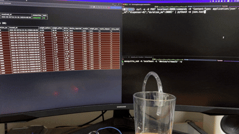
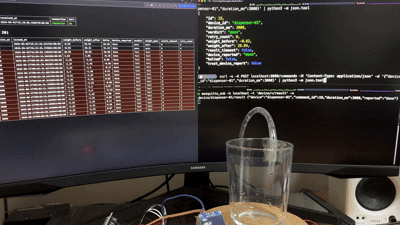
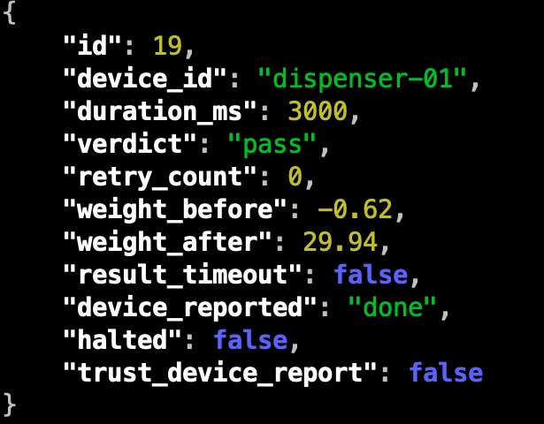
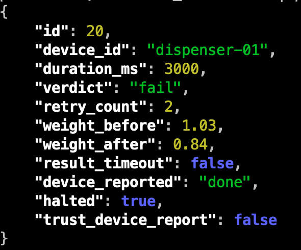
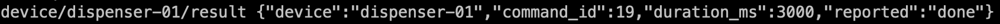
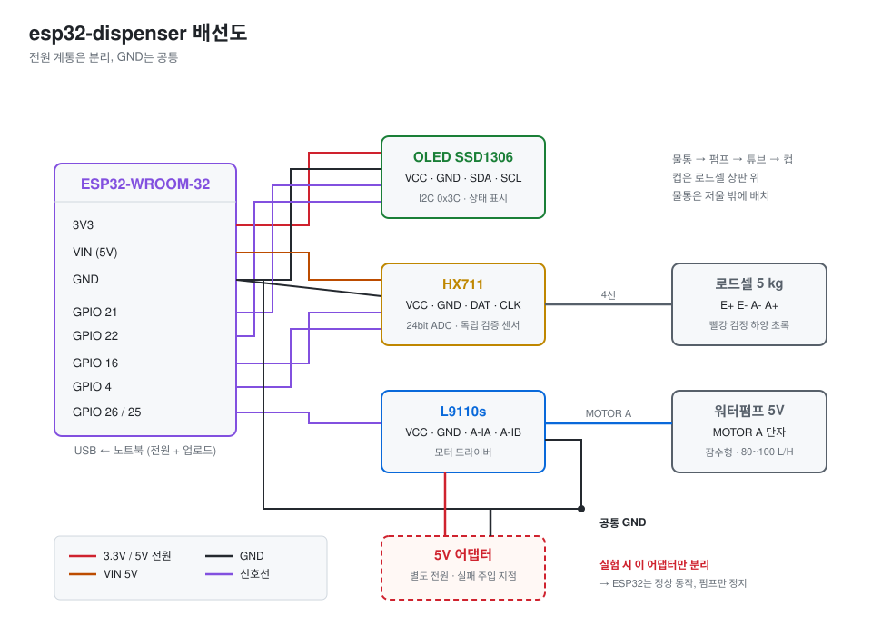

# esp32-dispenser

로드셀로 실제 토출량을 재서 디스펜싱 성공 여부를 판정하는 제어 시스템

## 데모

**정상 동작** — 펌프가 돌고 무게가 늘어남



**실패 감지** — L9110 전원을 분리한 상태. 장비는 `"done"`을 보고하지만 무게가 변하지 않아 실패로 판정



### 서버 응답 비교

| 정상 | 실패 |
|---|---|
|  |  |
| delta +30.56 g → `pass` | delta −0.19 g → `fail`, 3회 재시도 후 `halted` |

두 경우 모두 `device_reported`는 `"done"`. 장비는 명령을 수행했다고 보고했고 실제로 GPIO 신호도 출력했다. 판정을 가른 건 무게뿐이다.

### 장비가 발행한 result



장비가 보내는 건 `command_id`와 `"reported": "done"` 두 개뿐. 성공 여부를 담는 필드가 없다.

## 만든 이유

커피 자판기나 음료 디스펜서의 표준 제어 방식은 시간 기반이다. 타이머로 밸브를 정해진 시간만큼 열고, 시간이 지나면 밸브를 닫고 준비 상태로 돌아가 다음 주문을 받는다. 실제로 나왔는지는 확인하지 않는다.

펌프 전원이 나가거나 튜브가 막히면 아무것도 안 나오는데도 제어 보드는 신호를 보냈으니 성공으로 기록하고, 음료는 나오지 않은 채 동작이 마무리된다.

그래서 신호를 보낸 뒤에 실제로 나왔는지 확인하는 단계를 하나 더 붙여봤다.

## 판정 방식

ESP32는 "명령을 수행했다"까지만 보고하고, 성공 여부는 서버가 명령 전후 무게 차이로 판정한다.

효과를 확인하려고 토출이 물리적으로 불가능한 상태(L9110 전원 어댑터 분리)에서 두 방식을 각각 20회씩 돌렸다.

| 판정 방식 | N | pass | 평균 delta | 오판 |
|---|---|---|---|---|
| 장비 응답 기준 | 20 | 20 | 0.02 g | **20 / 20** |
| 무게 실측 기준 | 20 | 0 | 0.02 g | **0 / 20** |

평균 delta가 양쪽 다 0.02 g이니 물리 조건은 같았고, 판정만 갈렸다.

상세 조건과 원본 데이터 → [`docs/experiments/`](docs/experiments/)

## 구조

```
firmware/   ESP32 펌웨어 (PlatformIO). OLED, HX711 로드셀, L9110 펌프 제어, MQTT
server/     FastAPI. MQTT 구독/발행, SQLite, 검증 엔진, SSE 대시보드
scripts/    두 판정 방식 비교 실험 스크립트
docs/       트러블슈팅 기록, 실험 결과
```

| 영역 | 스택 |
|---|---|
| 펌웨어 | C++ / Arduino framework / PlatformIO |
| MCU | ESP32-WROOM-32 |
| 통신 | MQTT (Mosquitto) |
| 서버 | Python / FastAPI / paho-mqtt |
| 저장 | SQLite |

## 동작

1. `POST /commands` 수신 → 직전 무게 스냅샷 후 `device/{id}/command` 발행 (payload에 `command_id` 포함)
2. 장비가 펌프를 구동한 뒤 `device/{id}/result`로 같은 `command_id`를 echo하며 `"done"` 보고
3. 서버가 (발행 시각 + `duration_ms` + `stabilization_delay_s`) 시점에 무게를 재측정하고 delta가 기대범위 안인지 확인
4. 범위 밖이면 재시도, 3회 연속 실패 시 HALT (신규 명령 거부, resume API로만 해제)
5. `trust_device_report`를 켜면 무게 대신 장비 응답으로 판정 (비교 실험용, 런타임 토글)

`result` payload에 성공/실패 필드를 두지 않았다. 장비는 실행 사실만 알 뿐 결과는 모르기 때문.

result 대기와 무게 측정은 별도 코루틴으로 돌린다. 장비 응답이 늦거나 아예 없어도 무게는 예정된 시점에 재므로, 응답 없이 실행만 된 경우까지 판정할 수 있다.

### MQTT 토픽

| 토픽 | 방향 | payload |
|---|---|---|
| `device/{id}/command` | 서버 → 장비 | `{"command_id": 1, "duration_ms": 3000}` |
| `device/{id}/result` | 장비 → 서버 | `{"command_id": 1, "reported": "done"}` |
| `device/{id}/telemetry` | 장비 → 서버 | `{"weight_g": 12.34}` (1초 주기) |

## 계측

| 항목 | 값 |
|---|---|
| 보정 계수 | 405.0 |
| 100 g 측정값 | 100.3 ~ 100.6 g (오차 약 0.4%) |
| 무부하 편차 | ±0.3 g |
| 3000 ms 명령 평균 토출량 | 74.4 g (표준편차 1.9 g, 5회) |
| 필터 | 10회 이동 평균 |

기대범위 자체는 이 실측을 근거로 30 ~ 300 g으로 넓게 잡았다.

## 배선



| 부품 | 신호 | GPIO |
|---|---|---|
| OLED (SSD1306) | SDA / SCL | 21 / 22 |
| HX711 | DAT / CLK | 16 / 4 |
| L9110 | A-IA / A-IB | 26 / 25 |

ESP32와 OLED는 USB 5V 계통, HX711은 VIN(5V), 펌프는 별도 5V 어댑터. **+는 분리하고 GND만 공통으로 묶는다.**

## 실행

### 펌웨어

`firmware/src/secrets.h` 양식

```cpp
#pragma once
#define WIFI_SSID     "..."
#define WIFI_PASSWORD "..."
#define MQTT_HOST     "..."
#define MQTT_PORT     1883
#define DEVICE_ID     "dispenser-01"
```

```bash
cd firmware
pio run -t upload
```

### 서버

```bash
cd server
python3 -m venv .venv
.venv/bin/pip install -r requirements.txt
.venv/bin/uvicorn main:app --reload
```

MQTT 브로커가 `MQTT_HOST`/`MQTT_PORT`(기본 `localhost:1883`)에 떠 있어야 한다.

### API

| 엔드포인트 | 설명 |
|---|---|
| `POST /commands` | `{device_id, duration_ms}` — 발행 + 판정까지 끝내고 결과 반환. HALT 상태면 409 |
| `POST /devices/{device_id}/resume` | HALT 해제 |
| `GET /config` | 설정 조회 |
| `POST /config` | 보낸 필드만 부분 갱신 |
| `GET /events` | SSE 실시간 스냅샷 |

### 대시보드

`http://localhost:8000/` — 장비별 현재 무게·연결 상태·HALT 여부, 최근 명령 20건을 1초 간격으로 갱신

`trust_device_report`로 pass 판정된 행에도 무게 기준 판정을 함께 계산해 보여준다. 장비 응답과 실측이 어긋난 행은 강조 표시.

### 실험 스크립트

```bash
python3 scripts/experiment.py --device-id dispenser-01 --duration-ms 3000
```

두 판정 방식을 각각 20회씩 실행하고 CSV로 저장. HALT가 걸리면 자동으로 resume하고 계속 진행한다.

## 한계

- 판정 근거가 무게 하나뿐이라 로드셀이 고장 나면 판정 불가. 센서를 늘려 교차 검증할 수 있지만 그만큼 고장날 지점도 늘어난다
- 토출 중 컵을 만지면 무게가 왜곡됨. 실제 장비라면 컵 거치 확인 인터록 필요
- 장비 연결 상태를 "최근 5초 내 telemetry 수신 여부"로 판단하는 휴리스틱. MQTT LWT를 쓰면 정확해진다
- 장비 무응답 시 `result_wait_s`(10초)까지 기다린 뒤 재시도해서 HALT까지 최악 30초
- 오프라인 버퍼가 RAM에 있어 전원이 나가면 유실
- 소형 펌프라 물통 수위에 따라 토출량이 변함. 기대범위를 넓게 잡아 대응

## 문서

- [`docs/troubleshooting.md`](docs/troubleshooting.md) — 개발 중 겪은 문제와 원인
- [`docs/experiments/`](docs/experiments/) — 판정 방식 비교 실험 결과